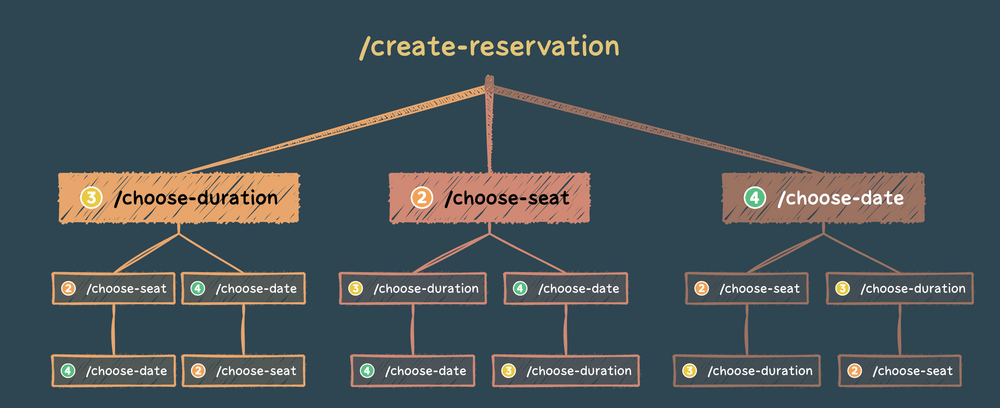

# Miss Click Booker Bot

A compact Telegram bot using a webhook to reserve seats for a 'Miss Click' club.

## How It Works

This bot employs a step-based system. The steps are not strictly sequential, meaning Step 1 can come after Step 2, and Step 5 can follow Step 2. This flexible system allows us to discern the user's current stage.

Each step essentially involves two actions: selecting a command and entering a value. Therefore, a step is reinforced by a flag, in this case called 'stepFinished.'

### Possible user steps
